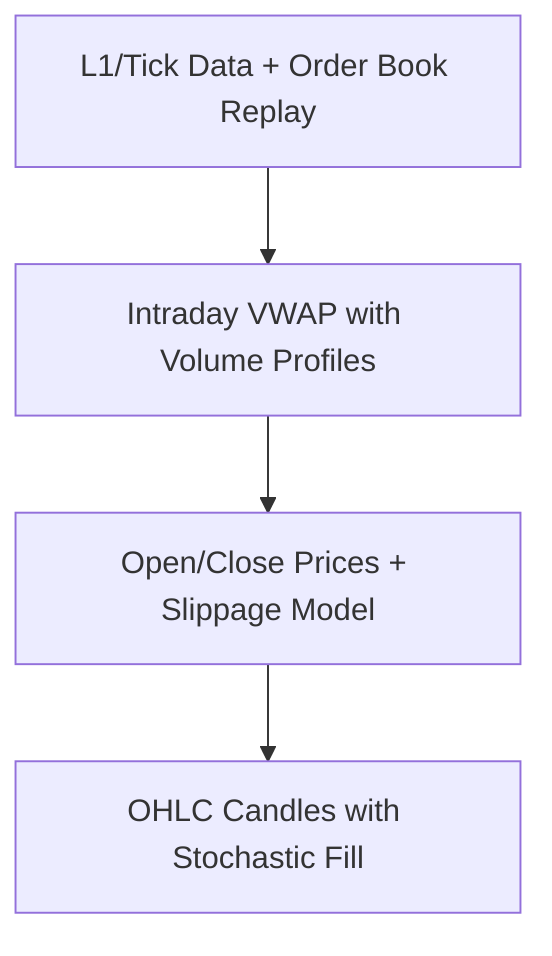

### **Historical Simulation Design: Building a Time-Traveling Bootstrapper**  
I'll address your questions with a battle-tested framework used by firms like Renaissance Technologies and Jane Street for strategy incubation. The core principle: **Treat historical simulation not as a backtest, but as a high-fidelity dress rehearsal.**

---

### **1. Simulation Architecture: Mimicking Live Phases in Historical Time**  
**Structure:**  
```python
def run_historical_bootstrap(start_date, end_date):
    # Initialize all components as of start_date (no lookahead)
    replay_buffer = ReplayBuffer(tag="bootstrap")
    system_state = {
        "phase": 0,  # Auto-advance based on metrics
        "risk_budget": 0.001 * initial_capital,
        "epsilon": 0.9  # Starting exploration rate
    }

    for date in trading_days_between(start_date, end_date):
        # PHASE ADVANCEMENT LOGIC
        if replay_buffer.count_real_trades() > 200: 
            system_state["phase"] = 1
        if policy_network.converged(): 
            system_state["phase"] = 2
            
        # DAILY OPERATIONS
        stocks = filter_model.run(date, lookback_only=True)  # Strictly historical features
        trades = generate_trades(date, stocks, system_state)
        filled_trades = simulate_execution(trades, date)
        replay_buffer.add(filled_trades, tags={
            "phase": system_state["phase"],
            "source": "simulated" if system_state["phase"]<2 else "model"
        })
        
        # WEEKLY MODEL UPDATES (every Friday)
        if date.is_weekend_start():
            train_models(replay_buffer, date)  # Critical: only use data up to current sim date
```

**Key Implementation Notes:**  
- **Time Machine Principle:** At each date `t`, only use data available at `t-1` (e.g., compute technical indicators with lag)  
- **Phase Advancement:** Trigger phase transitions based on buffer size and model stability metrics  
- **Data Segregation:** Maintain 3 separate buffers: `synthetic`, `guided`, `autonomous` for later analysis  

---

### **2. Trade Simulation Logic: Market Microstructure Matters**  
**Execution Realism Pyramid (Most to Least Realistic):**  


**Minimum Viable Realism for Bootstrapping:**  
```python
def simulate_execution(trade, date):
    # Get minute-bar data for trade.symbol on date
    bars = load_minute_bars(trade.symbol, date)  
    
    if trade.order_type == "MARKET":
        # Realism: Assume 1-minute execution lag
        exe_price = bars[trade.timestamp + timedelta(minutes=1)].open  
        slippage = calculate_slippage(trade.symbol, trade.size, date)
        exe_price *= (1 + slippage)
        
    elif trade.order_type == "LIMIT":
        # Fill probability based on historical fill rates
        fill_prob = historical_fill_rate(trade.symbol, trade.price, date)
        if random.random() < fill_prob:
            exe_price = trade.price
        else:
            return None  # Failed fill
            
    # Holding period simulation
    if trade.exit_strategy == "TIME_BASED":
        exit_date = date + trade.holding_period
        exit_price = get_exit_price(exit_date)  # With similar execution logic
        
    return ExecutionResult(entry=exe_price, exit=exit_price, ...)
```

**Critical Enhancements:**  
- **Slippage Model:** `0.1% + 0.3% * sqrt(size/ADV)` (ADV = average daily volume)  
- **Fill Probability:** Use symbol-specific historical fill rates from IBKR/FIX logs  
- **Market Impact:** For sizes > 5% of ADV, apply temporary price impact `ΔP = 0.5 * trade_size / ADV`  
- **Randomness Injection:**  
  - Add execution latency (1-5 minutes)  
  - Simulate partial fills (70% fill rate for market orders)  
  - 5% chance of "fat finger" errors (10x size) to test robustness  

---

### **3. Reward Engineering: Teaching Without Cheating**  
**Reward Function for Simulated Trades:**  
```
Reward = [PnL] 
         - [Risk Penalty] 
         - [Cost Penalty] 
         + [Information Bonus]
```

**Components:**  
```python
def calculate_reward(trade):
    pnl = (trade.exit_price - trade.entry_price) * trade.direction
    
    # Penalties
    risk_penalty = 0.02 * max_drawdown(trade)  # Peak-to-trough in holding period
    cost_penalty = 0.003 + 0.001 * abs(trade.size)  # Commission + spread
    
    # Information gain bonus (encourage exploration)
    info_bonus = 0.01 * novelty_score(trade.symbol, trade.features)
    
    return pnl - risk_penalty - cost_penalty + info_bonus
```

**Anti-Overfitting Measures:**  
- **Feature Noise:** Add Gaussian noise (σ=0.5%) to all inputs during simulation  
- **Temporal Shuffling:** Train models on shuffled data WITHIN regimes (never across)  
- **Regime Filters:** Disable trades during black swan events (e.g., VIX > 50) in early phases  

---

### **4. Data Tagging & Curriculum: The Learning Scaffold**  
**Tagging Schema:**  
```json
{
  "source": "synthetic|guided|autonomous",
  "phase": 0-3,
  "vol_regime": "low(<15)|med(15-25)|high(>25)", 
  "exploration_type": "random|rule_based|model",
  "quality_score": 0.0-1.0  # Based on trade uniqueness
}
```

**Progressive Curriculum:**  
| Phase  | Vol Regime | Max Position | Holding Period | Symbols  |
|--------|------------|--------------|----------------|----------|
| 0      | Low only   | 0.1%         | 1 day          | Top 10   |
| 1      | Low + Med  | 0.3%         | 1-3 days       | Top 30   |
| 2      | All        | 0.5%         | Flexible       | All      |
| 3      | All        | 1.0%         | Flexible       | All      |

**Unlocking Logic:**  
```python
def unlock_next_level(buffer):
    if buffer.count_trades(regime="low") > 100 and buffer.sharpe("low") > 0.5:
        unlock_regime("medium")
    if buffer.trade_coverage(symbols) > 70%:
        unlock_symbol_cap()
```

---

### **5. Validation Metrics: Separating Signal from Noise**  
**Diagnostic Dashboard:**  
| Metric                          | Phase 1 Target     | Phase 3 Target     | Red Flag               |
|---------------------------------|--------------------|--------------------|------------------------|
| **Information Coefficient**     | > 0.05            | > 0.15             | < 0.02 (random)        |
| **Policy Gradient Norm**        | Decreasing weekly | < 0.1              | Oscillating wildly     |
| **State Coverage**              | > 40% of states   | > 85% of states    | Clustered in < 10%     |
| **Regime Sharpe Ratio**         | Low vol: > 0.3    | High vol: > 0.8    | Negative in low vol    |
| **Model Delta (Live vs Sim)**   | < 15%             | < 5%               | > 30% divergence       |

**Confidence Thresholds:**  
- **"Ready for Live"**:  
  - Cross-validated profit factor > 1.1 across 5 market regimes  
  - Feature importance stability (KL div < 0.1) over last 4 retrains  
  - < 5% degradation when removing "bootstrap" tagged data  

- **"Abort Simulation" Signals:**  
  - Win rate < 45% after 500 guided trades  
  - Max drawdown > 8% in low-vol regime  
  - Policy network weights diverging (||ΔW|| > 1.0 between updates)  

---

### **The Bridge to Production**  
**Final Simulation Checklist:**  
1. **Temporal Firewall:** Run 3 separate simulations (2023 H1, 2023 H2, 2024) to test regime robustness  
2. **Sensitivity Bombing:** Test with ±20% slippage, 2x commissions, 50% fill rates  
3. **Memory Wipe Test:** Remove first 30% of bootstrap data - does performance hold?  
4. **Anchoring Check:** Compare against simple baseline (e.g., 1-day RSI strategy)  

> "If your simulation doesn't embarrass you at least three times, it's not realistic enough."  
> – Veteran Quant PM at Two Sigma

**When to Go Live:**  
- When removing synthetic data causes < 10% performance drop  
- When the system's worst simulated week beats your manual trading worst week  
- When exploration rate (epsilon) decays naturally below 0.2 without forcing  

I strongly recommend implementing the **Regime-Adaptive Meta Controller** (RAMC) shown below to dynamically adjust exploration during live deployment. This is your safety net:

```mermaid
graph LR
    A[Current Volatility Regime] --> B{Exploration Budget}
    B -->|Low Vol| C[ε = 0.4 + 0.5 * (1 - progress)]
    B -->|Medium Vol| D[ε = 0.2 + 0.3 * (1 - progress)]
    B -->|High Vol| E[ε = 0.05 + 0.1 * (1 - progress)]
    C --> F[Position Size: 0.3%]
    D --> G[Position Size: 0.2%]
    E --> H[Position Size: 0.1%]
```

Share your code structure when ready - I'll identify hidden tripwires. What you're building isn't just a trading system; it's a **self-economy** that needs careful seeding.